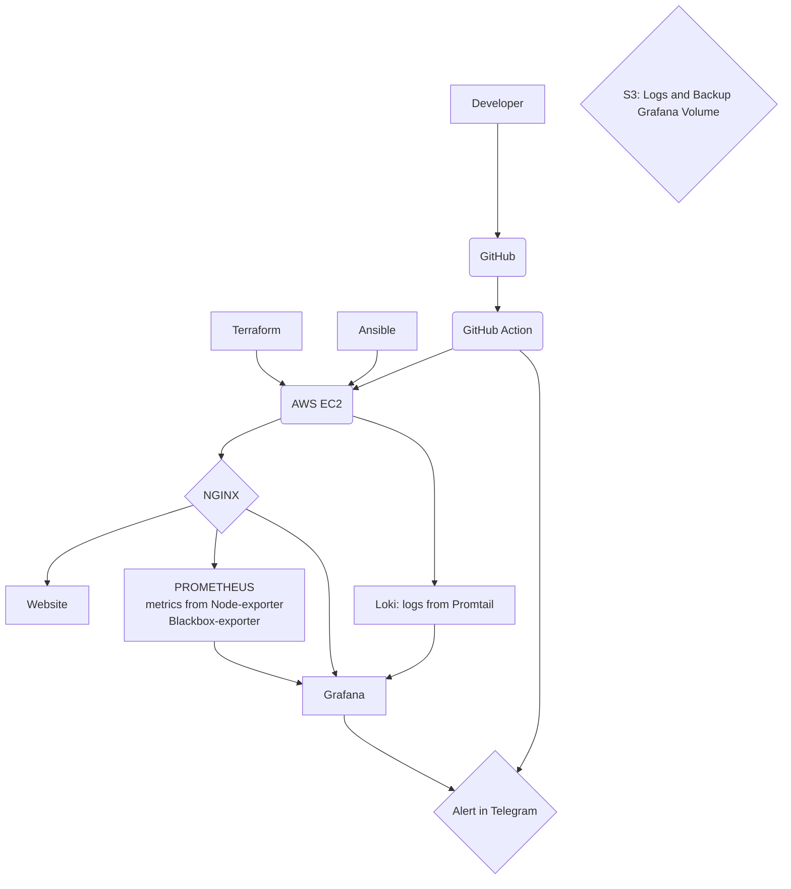

# 🚀 Portfolio Site - DevOps Project

> **Персональный сайт-портфолио с полным DevOps стеком**

## 📋 О проекте

Это учебный DevOps проект, демонстрирующий полный цикл разработки и деплоя веб-приложения. От статического сайта до продакшн-среды с мониторингом и автоматизацией.

### 🎯 Что делает проект

- **Статический сайт** на Hugo
- **Автоматический деплой** в облако AWS
- **Мониторинг** всех сервисов в реальном времени
- **Логирование** и сбор метрик
- **SSL сертификаты** и безопасность

## 🛠️ Технологический стек

### Frontend
- **Hugo** - генератор статических сайтов
- **BeautifulHugo** - тема для Hugo

### Контейнеризация
- **Docker** - контейнеризация приложения
- **Docker Compose** - оркестрация сервисов

### Инфраструктура
- **Terraform** - создание облачной инфраструктуры
- **Ansible** - развертывание программного обеспечения
- **AWS EC2** - облачный сервер

### Мониторинг
- **Prometheus** - сбор метрик
- **Grafana** - визуализация данных
- **Loki** - сбор логов
- **Promtail** - агент сбора логов

### Прокси и безопасность
- **Nginx** - reverse proxy
- **Let's Encrypt** - SSL сертификаты

## 🏗️ Архитектура

Схема

После деплоя доступны:

- **Сайт:** https://e-petko.dev
- **Grafana:** https://grafana.e-petko.dev
- **Prometheus:** https://prometheus.e-petko.dev

## 📝 Что применяется

- **Контейнеризация** - Docker и Docker Compose
- **Infrastructure as Code** - Terraform
- **Configuration as Code** - Ansible
- **Мониторинг** - Prometheus, Grafana, Loki
- **Облачные технологии** - AWS EC2, S3
- **CI/CD** - GitHub Actions
- **Безопасность** - SSL, Security Groups

## 👨‍💻 Автор

**Петько Евгений** - Junior DevOps Engineer

- 📧 Email: zhen.petko@gmail.com
- 💼 LinkedIn: [zhenyapetko](https://linkedin.com/in/zhenyapetko)
- 🐙 GitHub: [zhenyapetko](https://github.com/zhenyapetko)

---
